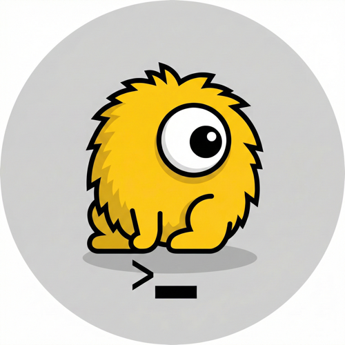

<p align="center">
  
</p>

<h1 align="center">Dingleberry</h1>

<p align="center"><strong>The emergency brake for AI agents.</strong></p>

A local daemon that sits between your AI coding agents and your system, intercepting every shell command and MCP tool call. Dangerous operations get held for human approval in a real-time dashboard before they can touch your files, your git history, or your database.

Because AI agents that can `rm -rf /` without asking should not exist in the wild.

---

## The Problem

AI coding agents are getting more powerful and more autonomous. That's great — until one of them:

- Force-pushes over your main branch
- Drops a production database table
- Runs `curl | bash` from an untrusted source
- Deletes your `.env` file
- Does a `chmod 777` on your SSH keys

These aren't hypotheticals. A Meta AI safety director [watched an OpenClaw agent delete her entire inbox](https://techcrunch.com/2026/02/23/a-meta-ai-security-researcher-said-an-openclaw-agent-ran-amok-on-her-inbox/) while she screamed "STOP" at it. Microsoft [warns](https://www.microsoft.com/en-us/security/blog/2026/02/19/running-openclaw-safely-identity-isolation-runtime-risk/) that OpenClaw shouldn't run on standard workstations. The trust model is broken: agents request unlimited shell access, and you either grant it or don't use the tool.

**Dingleberry** fills the gap. It's a universal, agent-agnostic interceptor that works with *any* AI coding tool, classifies every action against YAML policy rules, and blocks dangerous operations until a human says "yes." Read the full story: **[Why Dingleberry Exists](docs/why.md)**.

## How It Works

```
AI Agent (Claude Code / Cursor / Aider / etc.)
    |
    v
[Dingleberry - localhost:4000]
    |-- Classifies command against YAML policy
    |-- Safe? Auto-approve, forward instantly
    |-- Dangerous? Hold in queue, notify human
    |-- Human approves/rejects via LiveView dashboard
    |
    v
Your actual shell / MCP server
```

The magic: `Queue.submit/1` **blocks the agent's request in-flight** using Elixir's `GenServer.reply/2` pattern. The AI agent literally cannot proceed until you click Approve or Reject. No polling. No race conditions. Just OTP doing what it was born to do.

## Quick Start

```bash
# Clone it
git clone https://github.com/chronicle-code/dingleberry.git
cd dingleberry

# Set up
mix setup

# Initialize your config
mix dingleberry.init

# Run it
mix phx.server
```

Open [localhost:4000](http://localhost:4000) and you'll see the dashboard.

### Wire Up Your AI Tool

Dingleberry works as an MCP proxy — it wraps your real MCP servers and intercepts tool calls. Pick your tool below and paste the config.

<details>
<summary><strong>Claude Code</strong></summary>

Edit `~/.claude/claude_desktop_config.json`:

```json
{
  "mcpServers": {
    "filesystem": {
      "command": "mix",
      "args": [
        "dingleberry.proxy",
        "--command", "npx",
        "--args", "@modelcontextprotocol/server-filesystem /home/user/projects"
      ],
      "cwd": "/path/to/dingleberry"
    }
  }
}
```

Replace `/path/to/dingleberry` with wherever you cloned the repo, and update the filesystem path to your project directory.

</details>

<details>
<summary><strong>Cursor</strong></summary>

Edit `.cursor/mcp.json` in your project root (or `~/.cursor/mcp.json` for global):

```json
{
  "mcpServers": {
    "filesystem": {
      "command": "mix",
      "args": [
        "dingleberry.proxy",
        "--command", "npx",
        "--args", "@modelcontextprotocol/server-filesystem /home/user/projects"
      ],
      "cwd": "/path/to/dingleberry"
    }
  }
}
```

</details>

<details>
<summary><strong>Windsurf</strong></summary>

Edit `~/.codeium/windsurf/mcp_config.json`:

```json
{
  "mcpServers": {
    "filesystem": {
      "command": "mix",
      "args": [
        "dingleberry.proxy",
        "--command", "npx",
        "--args", "@modelcontextprotocol/server-filesystem /home/user/projects"
      ],
      "cwd": "/path/to/dingleberry"
    }
  }
}
```

</details>

<details>
<summary><strong>Cline (VS Code)</strong></summary>

Open VS Code settings (`Cmd+,` / `Ctrl+,`), search for "Cline MCP", click "Edit in settings.json", and add:

```json
{
  "cline.mcpServers": {
    "filesystem": {
      "command": "mix",
      "args": [
        "dingleberry.proxy",
        "--command", "npx",
        "--args", "@modelcontextprotocol/server-filesystem /home/user/projects"
      ],
      "cwd": "/path/to/dingleberry"
    }
  }
}
```

</details>

<details>
<summary><strong>Any MCP Client (SSE/HTTP)</strong></summary>

If your client supports SSE transport instead of stdio, point it directly at Dingleberry's HTTP endpoints — no `mix dingleberry.proxy` needed:

```
SSE endpoint:  http://localhost:4000/mcp/sse
POST endpoint: http://localhost:4000/mcp/message
```

Start Dingleberry with `mix phx.server`, then configure your client to connect to the SSE endpoint. Dingleberry will proxy to the real MCP server and intercept tool calls.

</details>

> **Pattern:** The config is always the same — wherever you had `"command": "npx"` pointing at an MCP server, you replace it with `"command": "mix"` pointing at `dingleberry.proxy`, which wraps the original server. Your AI tool talks to Dingleberry, Dingleberry talks to the real server.

### As a Shell Interceptor

```bash
# Interactive mode — classifies every command you type
mix dingleberry.shell

dingleberry> ls -la          # Auto-approved (safe)
dingleberry> rm -rf ./build  # Held for approval in dashboard
dingleberry> rm -rf /        # Instantly blocked by policy
```

## Policy Engine

Dingleberry ships with ~25 sane default rules in three tiers:

| Tier | Behavior | Examples |
|------|----------|---------|
| **Block** | Instantly rejected, never forwarded | `rm -rf /`, `DROP DATABASE`, fork bombs, `dd if=` |
| **Warn** | Held for human approval | `git push --force`, `rm -rf`, `curl \| bash`, `chmod 777`, `kill -9` |
| **Safe** | Auto-approved, forwarded instantly | `ls`, `cat`, `grep`, `git status`, `mix test` |

Rules are YAML with regex patterns:

```yaml
rules:
  - name: git_force_push
    description: "Force push to remote"
    action: warn
    patterns:
      - "git\\s+push\\s+.*--force"
    scope: shell
```

Edit `~/.dingleberry/policy.yml` and click "Reload Policy" in the dashboard. No restart needed.

## Dashboard

The LiveView dashboard at `localhost:4000` gives you:

- **Dashboard** — Pending approval cards with one-click Approve/Reject
- **History** — Full audit log of every intercepted command
- **Policy** — View and reload your YAML rules
- **Sessions** — Active MCP proxy sessions

All real-time via Phoenix PubSub. When an agent triggers a warn/block rule, the card appears instantly.

## Desktop Notifications

When a command needs approval, Dingleberry sends a native OS notification:
- **macOS**: via `osascript`
- **Linux**: via `notify-send`

So you'll know immediately even if the dashboard isn't in focus.

## Built on Jido

Dingleberry is proudly built on the [Jido](https://github.com/agentjido/jido) ecosystem — an Elixir framework for building autonomous agent systems. We leverage the **full depth** of three core Jido libraries:

### [jido_action](https://hex.pm/packages/jido_action) — Structured Actions with Full Lifecycle

Every operation in Dingleberry is a **Jido Action** with validated input/output schemas, lifecycle hooks, compensation, and LLM tool generation:

| Action | Category | Features |
|--------|----------|----------|
| `ClassifyCommand` | policy | `output_schema`, `on_before_validate_params` (trims input), `to_tool()` |
| `ClassifyToolCall` | policy | `output_schema`, `to_tool()` for LLM function-calling |
| `ApproveRequest` | approval | `output_schema`, `to_tool()` |
| `RejectRequest` | approval | `output_schema`, `to_tool()` |
| `RecordAudit` | audit | `output_schema`, `compensation`, `on_after_run`, `on_error` |

All 5 actions expose `to_tool()` for OpenAI/Claude function-calling integration. The **LLM Tools API** at `/api/v1/tools` lists them as tool definitions and `/api/v1/tools/:name/run` executes them via `Jido.Exec.run` with full validation.

### [jido_signal](https://hex.pm/packages/jido_signal) — CloudEvents Signal Bus with Extensions & Journal

Every interception, classification, and decision flows through a **Jido Signal Bus** as [CloudEvents v1.0.2](https://cloudevents.io/) compliant signals:

- `dingleberry.command.intercepted` — Emitted when a command is caught
- `dingleberry.command.decided` — Emitted when a human (or auto-policy) makes a decision
- `dingleberry.policy.matched` — Emitted when a policy rule matches

**Signal Extensions** (via `Jido.Signal.Ext`) attach type-safe metadata to signals:

| Extension | Namespace | Fields |
|-----------|-----------|--------|
| `RiskMetadata` | `risk.metadata` | `risk_level`, `risk_score`, `classified_at` |
| `AuditContext` | `audit.context` | `session_id`, `hostname`, `request_id` |
| `DecisionContext` | `decision.context` | `decision_time_ms`, `approver_id` |

**ETS Journal** persistence is enabled on the bus for signal replay and debugging. The bus runs a **middleware pipeline** with both publish and dispatch callbacks:

1. **RiskClassifier** — `before_publish` + `before_dispatch` (attaches risk metadata extension)
2. **AuditLogger** — `after_publish` + `after_dispatch` (records to SQLite, logs dispatch results)
3. **Logger** — Debug logging via `Jido.Signal.Bus.Middleware.Logger`

### [jido](https://hex.pm/packages/jido) — Core Framework

The Jido core provides `Jido.Exec` for action execution with retries, timeouts, compensation, and telemetry — tying actions and signals together into a cohesive system.

> Jido gave us CloudEvents compliance, a middleware pipeline, signal extensions, ETS journal persistence, and action schemas with LLM tool generation out of the box — so we could focus on the interception logic instead of reinventing event infrastructure.

## LLM Tools API

Dingleberry exposes all actions as LLM-compatible tool definitions:

```bash
# List all available tools
curl http://localhost:4000/api/v1/tools

# Get a single tool definition
curl http://localhost:4000/api/v1/tools/classify_command

# Execute a tool
curl -X POST http://localhost:4000/api/v1/tools/classify_command/run \
  -H "Content-Type: application/json" \
  -d '{"params": {"command": "rm -rf /"}}'
```

This enables AI agents to discover and invoke Dingleberry's capabilities through standard function-calling protocols.

## Architecture

Built on Elixir/OTP and the Jido ecosystem because this is fundamentally a concurrency problem — you need to hold N agent requests in-flight simultaneously while a human makes decisions asynchronously.

- **Jido Actions** — 5 validated actions with input/output schemas, lifecycle hooks, compensation, and `to_tool()` LLM integration
- **Jido Signal Bus** — CloudEvents middleware pipeline with extensions, ETS journal, and dispatch callbacks
- **Signal Extensions** — Type-safe metadata (risk, audit, decision) attached to signals via `Jido.Signal.Ext`
- **LLM Tools API** — REST endpoints exposing all actions as OpenAI/Claude function-calling tools
- **Policy Engine** — GenServer with compiled regex patterns from YAML
- **Approval Queue** — GenServer using deferred `reply/2` to block callers
- **MCP Proxy** — JSON-RPC 2.0 codec + bidirectional Port to real MCP server
- **Shell Interceptor** — Command parser + policy check + conditional execution
- **Audit Log** — SQLite via Ecto for zero-config persistence
- **LiveView Dashboard** — Real-time UI via Phoenix PubSub

## Configuration

`~/.dingleberry/config.yml`:

```yaml
port: 4000
approval_timeout_seconds: 120
desktop_notifications: true
log_level: info
```

## Requirements

- Elixir 1.15+
- Erlang/OTP 26+

That's it. No Docker. No cloud. No API keys. Everything runs on your machine.

## License

Apache-2.0. See [LICENSE](LICENSE).

---

*Named after the thing that hangs on and won't let go — just like this daemon hangs onto every dangerous command until you say it's okay.*
